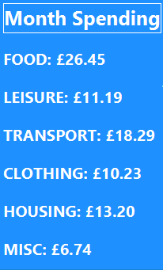

# Spending Tracker App: Overview
This project is a desktop application, aimed at UK residents (currency units are *£* pound sterling), for tracking personal monthly and weekly spending of a non-commercial nature. It also presents the user with some useful summary statistics outlined below.

## User Guide
The application currently has **6 categories** of spending:
 * **FOOD** - Any expenses related to diet.
 * **LEISURE** - For any expenses related to recreation.
 * **TRANSPORT** - Covers expenses related to transport such as fuel costs, insurance or train fares etc.
 * **CLOTHING** - For any clothing expenses.
 * **HOUSING** - A broad category for anything related to home maintenance from monthly rent to buying new furniture or housing renovations.
 * **MISC.** - Miscellaneous spending that does not fall into any of the categories above.
#### Inserting Records
  Records are inserted by inputting spending into the text box, selecting the category it belongs to and pressing the *Enter* button. **The maximum limit for any entry must be *£100,000* or below**. Total overall spending also cannot exceed *£100,000*. The program will ignore any input which causes the total spending for the month to exceed this figure.

  #### Deleting Records
  Records may be deleted from the database by:
  1. ) Right-clicking the record to be deleted in the spending table.
  2. ) Left-clicking the *'Delete'* option that appears in the dropdown menu.  

 #### Overview of Summary Statistics
 The app provides a summary total spending for the current week and month:

 

 It also provides a summary of how much has been spent on each category in the current month and a breakdown of their values as a percentage of total spending, as indicated by the pie-chart:

 

 On the bottom-left is a summary of much was spent in the month on each category:

 

    
 

